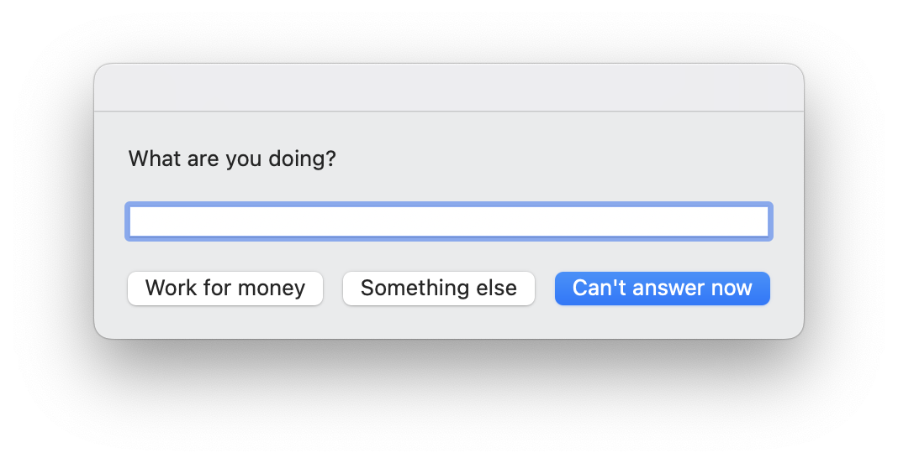
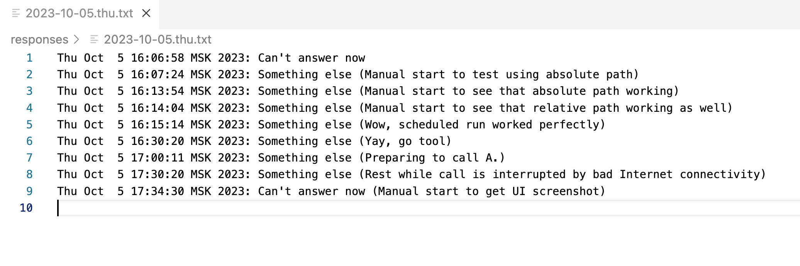

# WhatYouDoing

This is a macOS tool to ask me "What are you doing?" and record the answer. Its purpose is to gather data for work reporting. Moreover, I want to analyze this data to understand my computer activities better.

It is intended to be run at every half-hour mark by cron — e.g, at 8:00, 8:30, etc.

## Setup
1. Clone the repository and change directory to it.

2. Make sure that `run.sh` is executable. Open this directory in terminal and run:

    ```sh
    chmod +x run.sh
    ```

3. Test run `run.sh` by running:

    ```sh
    ./run.sh
    ```

    If you see a message "What are you doing?", then everything is fine. Choose any response that you want.

    

4. See the results in `responses` folder. Each day has its own file.

    

## Schedule
1. Edit your cron table by running:

    ```sh
    crontab -e
    ```

2. Add the following line to your crontab:

    ```sh
    */30 * * * * /path/to/what-you-doing/run.sh
    ```

    This will run `run.sh` at every half-hour mark. You can change the interval to whatever you want.
